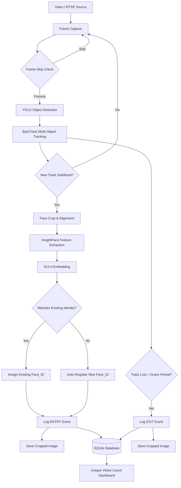

# System Architecture

## Overview
The Intelligent Face Tracker is designed to process video streams in real-time, detect faces, maintain continuous tracking of individuals, extract facial embeddings, and automatically register and count unique visitors.

## Data Flow Diagram

## Component Architecture

1. **Input Module (`src/video.py`)**
   - Handles RTSP or MP4 ingestion using OpenCV.
   - Implements configurable frame skipping to reduce compute load.

2. **Detection & Tracking Module (`src/tracker.py`)**
   - Uses `ultralytics` YOLOv8 paired with ByteTrack.
   - Detections are immediately fed into the ByteTrack association algorithm, which utilizes Kalman Filters to predict bounding box locations when occlusions occur.

3. **Recognition Module (`src/recognizer.py`)**
   - Uses the `buffalo_l` model from InsightFace, comprising the RetinaFace detector (to refine the YOLO bounding box crop) and ArcFace recognizer (to generate embeddings).
   - In-memory matching prevents costly DB blob searches.

4. **Event Logger Module (`src/event_logger.py`)**
   - Implements grace periods to stabilize tracks before classifying them as true Entries.
   - Saves physical images to disk logically structured by Date.

5. **Storage Module (`src/database.py`)**
   - Synchronous SQLite operations. 
   - `VISITORS` table stores identities, `EVENTS` table logs every interaction.
